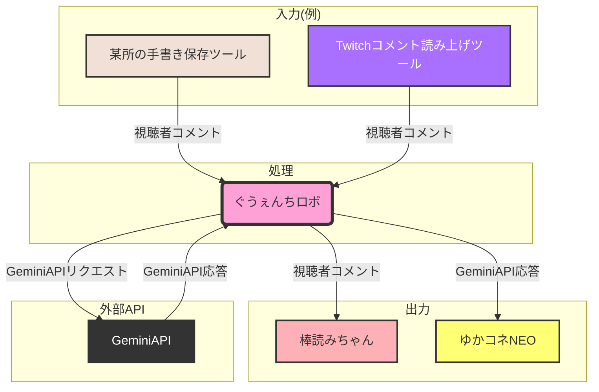

# ぐうぇんちロボ
視聴者が VTuber 風のキャラクターと対話することができるシステムです

## 環境構築

### 1. 設定ファイルの準備

1.  `config.ini.sample` ファイルをコピーし、`config.ini` に名前を変更します。

### 2. 設定ファイルの編集 (`config.ini`)

1.  `config.ini` ファイルを開き、以下の設定を環境に合わせて変更します。
    *   **`http_port`:** 手書きコメント保存ツールなどの、外部ツールがぐうぇんちロボに接続するためのポート番号を指定します。デフォルトでは `51002` が設定されています。
    *   **`bouyomi_port`:** 棒読みちゃんが使用するポート番号を指定します。棒読みちゃんのポート番号設定と一致させてください。
    *   **`api_key`:** Gemini API の API キーを指定します。[^1]

### 3. ポート番号の設定 (手書きコメント保存ツールなど)

1.  手書きコメント保存ツールなど、外部ツールが棒読みちゃんに送信するはずだった通信をぐうぇんちロボが受け取るように、各ツールの設定でポート番号を `http_port` で設定したポート番号に変更します。
    * 例：手書きコメント保存ツールの設定で、棒読みちゃんへの送信ポートを `51002` に設定します。

### 4. キャラクター設定のカスタマイズ (`persona.ini`)

1.  `persona.ini` ファイルを編集し、キャラクターの性格や口調などの設定をカスタマイズします。

### 5. プログラムの実行

1.  上記の設定が完了したら、プログラムを実行します。

## いろいろ
応答メッセージの発話は現在ゆかコネNEOを介したものにしか対応してません

[^1]: apiキーは「Gemini APIキー取得」とかで調べてくれよな
  無料版で十分なはずだけど不意に課金されたりしないように気をつけて
