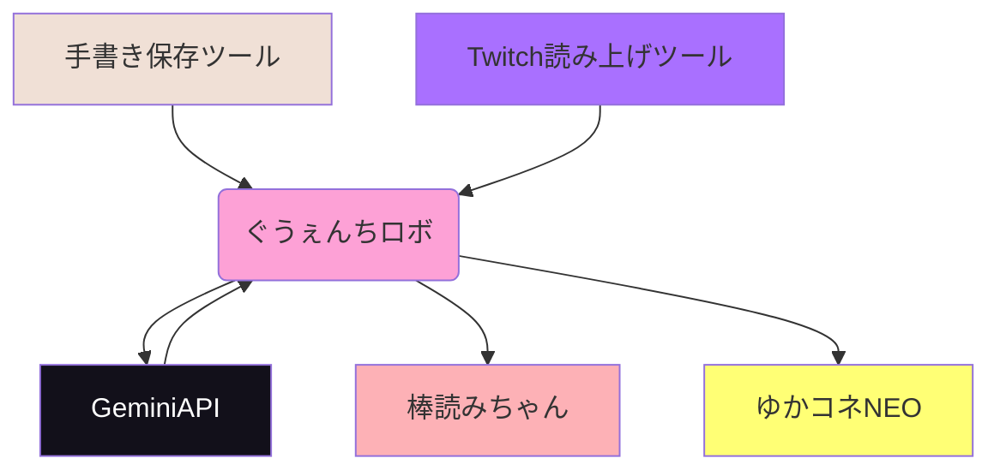

# ぐうぇんちロボ

視聴者が VTuber 風のキャラクターと対話することができるシステムです
基本的に某所配信者向け

棒読みちゃんで視聴者コメントを読み上げて
ゆかコネNEOで応答を読み上げます

## 環境構築

1.  Git リポジトリをクローンします。
2.  `config.ini.sample` を `config.ini` にコピーします。
3.  `config.ini` を開き、以下の設定を必要に応じて変更します。
     *`api_key`に、Gemini API の API キーを記述します。
4. `persona.ini`を編集し、キャラクターの設定をカスタマイズします。
5. プログラムを実行します。
